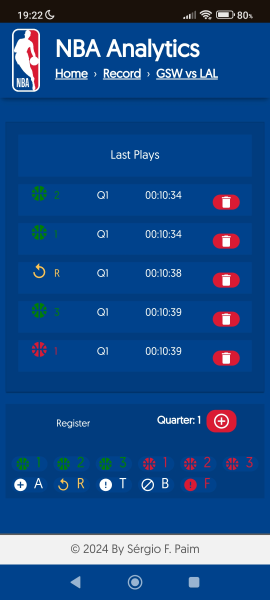
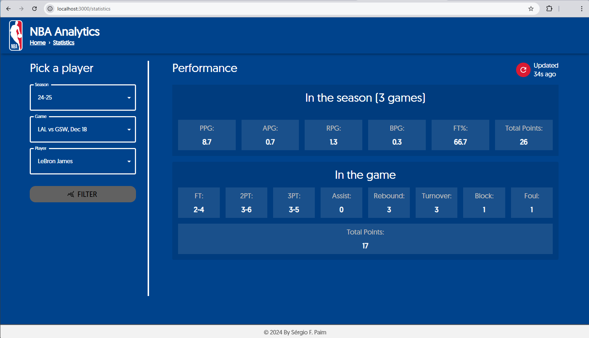
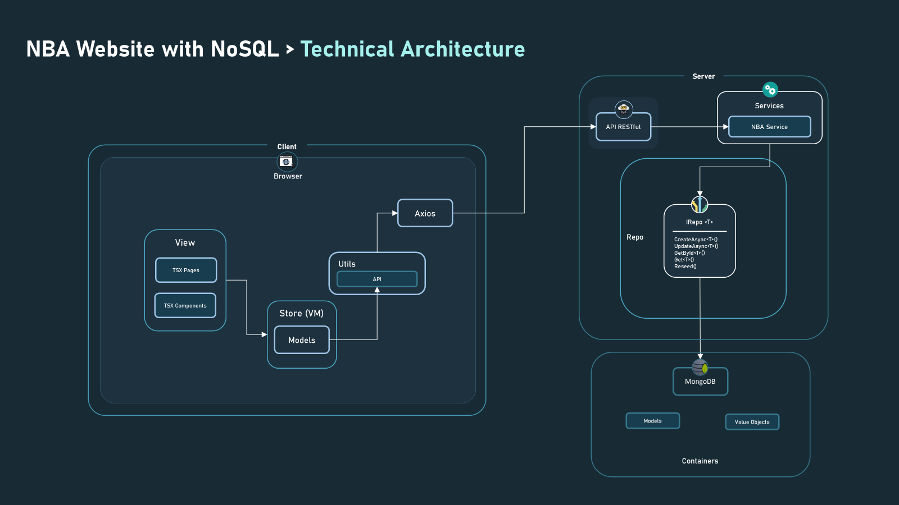
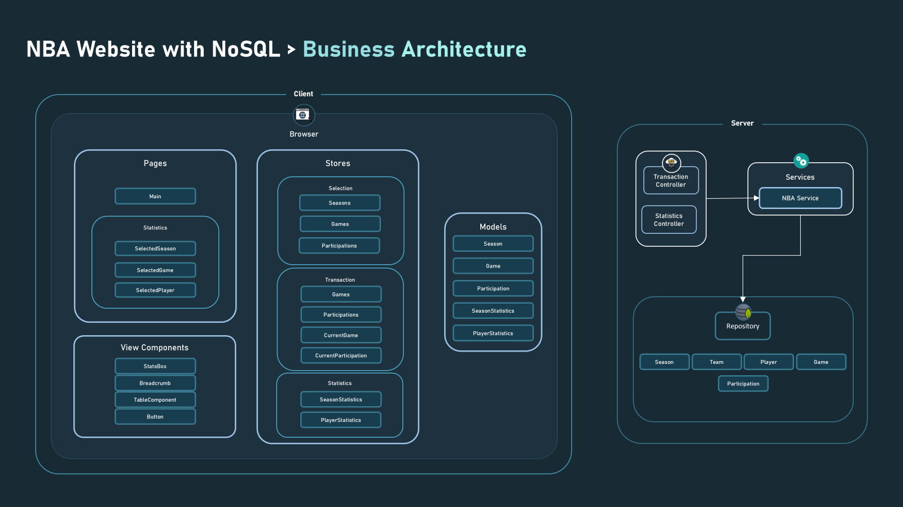
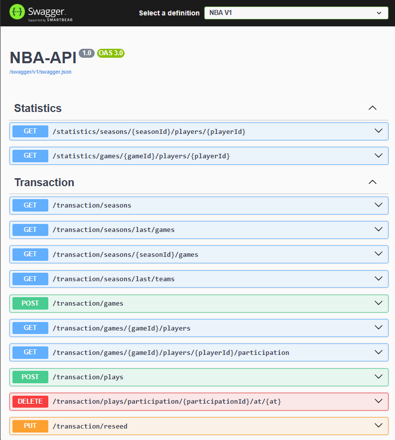

# Java with MongoDB

## Scope

### **Business Domain (Problem)**

This project focuses on managing the statistics of an NBA season, addressing two core functional requirements (use cases):

1. **Game Analysts**: Registering plays for a given player participating in a game as they occur in real-time.


    
2. **Reporters**: Querying the statistics to provide live insights about teams, players, and the ongoing game for their audience.



### **Technical Domain (Solution)**

To provide an intuitive and seamless experience, a **Graphical User Interface (GUI)** was selected to facilitate data input and querying, supporting real-time game narration.

### **Architecture Overview**



The technical architecture diagram showcases the system’s organization. It details the flow from view components to API calls made via Axios, passing through the backend and interacting with Cosmos DB containers.



The business architecture diagram outlines how the business components are structured. It highlights the organization of pages, models, Redux stores, and reusable View Components created to ensure consistency across the application. 



The backend exposes an API with the following endpoints.

## Learnings

#### **Database Languages and Operations**
In this project, I dove deep into NoSQL database management, specifically working with MongoDB. I learned how to effectively structure and manipulate data in a document-oriented environment, focusing on essential operations like creating, reading, updating, and deleting documents. Building a RESTful API allowed me to create smooth interactions with MongoDB, making it easy to retrieve and manage data. I also enjoyed developing a GUI interface, which improved user interaction with the database. Throughout this experience, I became more comfortable using the MongoDB driver for Java, which helped me work with flexible data handling. I gained valuable skills in deploying and managing database resources, deepening my understanding of cloud computing principles and best practices.

### **Model-View-ViewModel (MVVM)**

Through the creation of this system, I developed a strong understanding of the **MVVM** architectural pattern. I learned how to use this pattern to enhance the separation of concerns, providing a clear distinction between the user interface (View), the logic for data binding (ViewModel), and the data model (Model). By utilizing MVVM, I was able to implement a maintainable, scalable, and testable system where the View and Model are loosely coupled. This approach not only improved the code’s readability but also allowed for better reusability and ease of modification in the long run.

### **TypeScript, Vue, Nuxt and Pinia Learnings**

Through the development of my React project, I gained significant knowledge in **TypeScript**, **React**, and **Redux**. Here's a breakdown of my learnings:

#### **TypeScript**
- I became proficient in using **TypeScript** for adding static types to JavaScript, improving code safety and reducing runtime errors.
- I learned how to define **interfaces** and **types** to better structure data, ensuring clearer contracts between components and services.
- I gained a deeper understanding of **generics**, allowing me to write reusable, type-safe code across different parts of my application.
- I embraced **TypeScript's strict mode**, which enforced better coding practices, making my codebase more robust and maintainable.

## Vue.js

- **Component-Based Architecture**  
  Decomposed complex interfaces into small, self‑contained, and reusable components.

- **Composition API**  
  Utilized `ref`, `reactive`, and `computed` to manage local component state and side effects in a flexible, function‑centric style.

- **Vue Router**  
  Implemented nested routes, dynamic route parameters, and navigation guards to build seamless, multi‑page SPAs.

## Pinia

- **Global State Management**  
  Managed shared state across components in a predictable, type‑safe manner using Pinia stores.

- **Core Concepts**  
  Employed **stores**, **actions**, and **getters** to encapsulate business logic and state transformations.

- **Asynchronous Actions**  
  Handled API calls and side effects with promise‑based actions for clean, maintainable code.

- **Pinia Devtools**  
  Leveraged time‑travel debugging and action tracing to rapidly diagnose and fix state‑related issues.

## Nuxt.js

- **Server-Side Rendering & SSG**  
  Built performant SSR and statically generated sites with zero‑config setup and built‑in optimizations.

- **File-Based Conventions**  
  Streamlined routing with the `pages` directory, global layouts, and middleware for request‑level logic.

- **Dynamic Routing**  
  Created SEO‑friendly, scalable URLs using file‑based dynamic `[param]` routes.

- **Nuxt Devtools**  
  Used hot module replacement, error overlays, and integrated profiling to accelerate development and catch issues early.

# **Runtime Requirements for MongoDB**

1. **MongoDB**
    - **Purpose**: A NoSQL database for developing and testing applications without requiring a live subscription.
    - **Installation**: Download and install MongoDB from the official site:
        [Download MongoDB](https://www.mongodb.com/try/download/community)

2. **Required Java Development Kit (JDK)**
    - **Purpose**: Ensure that the correct version of the JDK is installed for seamless interaction with MongoDB.
    - **Download Link**: [Download JDK](https://www.oracle.com/java/technologies/javase-jdk11-downloads.html)

3. **MongoDB Java Driver**
    - **Purpose**: Facilitates interaction with MongoDB, enabling operations like reading, writing, and deleting data.
    - **Installation**: Add the MongoDB Java Driver dependency to your Maven project:
        ```xml
        <dependency>
            <groupId>org.mongodb</groupId>
            <artifactId>mongo-java-driver</artifactId>
        </dependency>
        ```

# **API Command Documentation**
 - To start the API with Swagger integration, execute the command in the CLI
   
    ```shell
    mvn spring-boot:run
    ```

# **Runtime Requirements for Vue, Pinia 3+ & Nuxt**

1. **Vue 3+**  
   - **Purpose**: Vue is a progressive JavaScript framework for building user interfaces with a reactive, component-based architecture.  
   - **Installation**: Ensure you have Node.js and npm (or Yarn) installed. To scaffold a new Vue 3 project with Vite:  
     ```bash
     npm init vite@latest my-vue-app -- --template vue
     cd my-vue-app
     npm install
     ```

2. **Pinia 3+**  
   - **Purpose**: Pinia is the official state‑management library for Vue 3, designed to be modular, type‑safe, and lightweight.  
   - **Installation**: Add Pinia to your Vue project and hook it into your app:  
     ```bash
     npm install pinia
     ```  
     In your `main.js`/`main.ts`:  
     ```js
     import { createApp } from 'vue'
     import { createPinia } from 'pinia'
     import App from './App.vue'

     const app = createApp(App)
     app.use(createPinia())
     app.mount('#app')
     ```

3. **Nuxt 3**  
   - **Purpose**: Nuxt is a higher‑level framework built on Vue 3 that provides server‑side rendering (SSR), static site generation (SSG), and opinionated conventions (file‑based routing, layouts, middleware).  
   - **Installation**: Use the Nuxt CLI to create a new Nuxt 3 project:  
     ```bash
     npx nuxi init my-nuxt-app
     cd my-nuxt-app
     npm install
     ```  
   - **Scripts**: Add or verify the following in your `package.json`:  
     ```json
     "scripts": {
       "dev": "nuxt dev",
       "build": "nuxt build",
       "preview": "nuxt preview",
       "start": "nuxt start"
     }
     ```

4. **Node.js & npm (or Yarn)**  
   - **Purpose**: Node.js provides the runtime for executing build tools and development servers; npm (or Yarn) manages project dependencies.  
   - **Installation**: Download and install the latest LTS version of Node.js (which includes npm) from:  
     [https://nodejs.org/](https://nodejs.org/)  
     Or install Yarn globally:  
     ```bash
     npm install -g yarn
     ```
