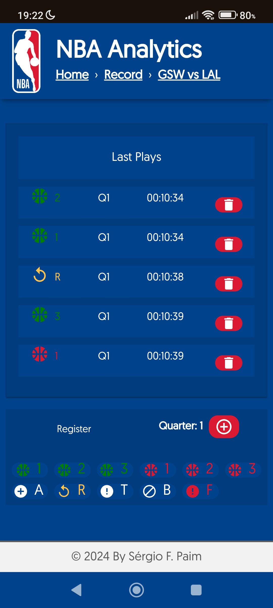
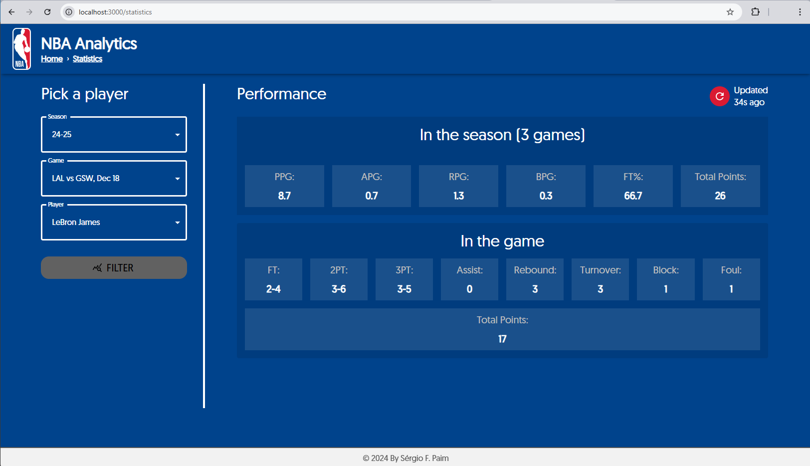
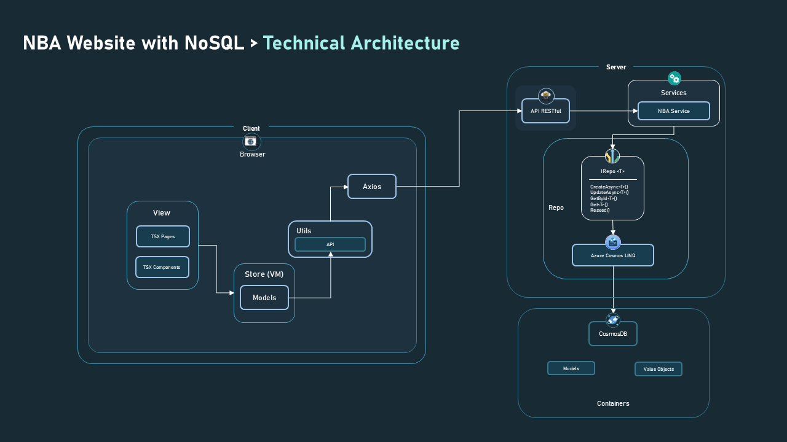
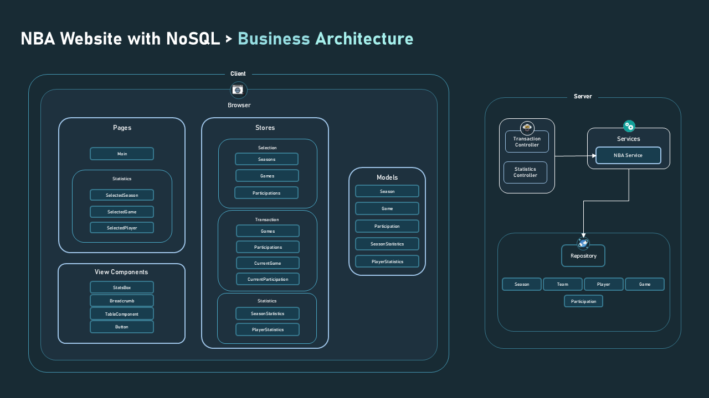
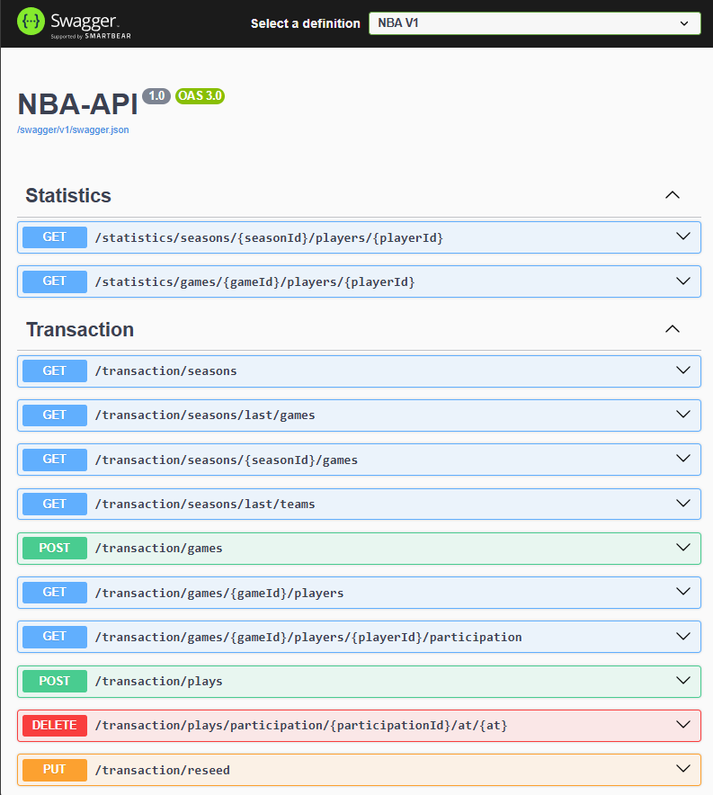

# WebSite with CosmosDB

## Scope

### **Business Domain (Problem)**

This project focuses on managing the statistics of an NBA season, addressing two core functional requirements (use cases):

1. **Game Analysts**: Registering plays for a given player participating in a game as they occur in real-time.


    
2. **Reporters**: Querying the statistics to provide live insights about teams, players, and the ongoing game for their audience.



### **Technical Domain (Solution)**

To provide an intuitive and seamless experience, a **Graphical User Interface (GUI)** was selected to facilitate data input and querying, supporting real-time game narration.

### **Architecture Overview**



The technical architecture diagram showcases the system’s organization. It details the flow from view components to API calls made via Axios, passing through the backend and interacting with Cosmos DB containers.



The business architecture diagram outlines how the business components are structured. It highlights the organization of pages, models, Redux stores, and reusable View Components created to ensure consistency across the application. 

My next goal is to explore how to integrate **Next.js** into the web application.



The backend, besides the CLI exposes, an API with the following endpoints.

## Learnings

#### **Database Languages and Operations**
In this project, I dove deep into NoSQL database management, specifically working with Azure Cosmos DB. I learned how to effectively structure and manipulate data in a document-oriented environment, focusing on essential operations like creating, reading, updating, and deleting documents. Building a RESTful API allowed me to create smooth interactions with the Cosmos DB, making it easy to retrieve and manage data. I also enjoyed developing a GUI interface, which improved user interaction with the database. Throughout this experience, I became more comfortable using the Microsoft.Azure.Cosmos library, which helped me work with generics for flexible data handling. I gained valuable skills in deploying and managing Azure resources, deepening my understanding of cloud computing principles and best practices.

### **Model-View-ViewModel (MVVM)**

Through the creation of this system, I developed a strong understanding of the **MVVM** architectural pattern. I learned how to use this pattern to enhance the separation of concerns, providing a clear distinction between the user interface (View), the logic for data binding (ViewModel), and the data model (Model). By utilizing MVVM, I was able to implement a maintainable, scalable, and testable system where the View and Model are loosely coupled. This approach not only improved the code’s readability but also allowed for better reusability and ease of modification in the long run.

### **TypeScript, React, and Redux Learnings**

Through the development of my React project, I gained significant knowledge in **TypeScript**, **React**, and **Redux**. Here's a breakdown of my learnings:

#### **TypeScript**
- I became proficient in using **TypeScript** for adding static types to JavaScript, improving code safety and reducing runtime errors.
- I learned how to define **interfaces** and **types** to better structure data, ensuring clearer contracts between components and services.
- I gained a deeper understanding of **generics**, allowing me to write reusable, type-safe code across different parts of my application.
- I embraced **TypeScript's strict mode**, which enforced better coding practices, making my codebase more robust and maintainable.

#### **React**
- I developed a strong understanding of **React's component-based architecture**, allowing me to break down my UI into small, reusable components.
- I became comfortable with **hooks** such as `useState`, `useEffect`, and `useReducer`, which helped me manage state and side effects in a functional programming style.
- I mastered **React Router** to manage navigation within the app and create a seamless user experience with dynamic page rendering.

#### **Redux**
- I learned how to use **Redux** for global state management, ensuring consistent and predictable application behavior.
- I became familiar with the core concepts of Redux, such as **actions**, **reducers**, and **store**, and how they work together to manage state.
- I understood the importance of **Redux Thunk** for handling asynchronous actions, allowing me to dispatch actions that involve side effects (like API calls) in a clean and manageable way.
- I gained experience in using **Redux DevTools** for debugging and tracing state changes during development, significantly improving my workflow and debugging efficiency.

# **Runtime Requirements for Azure Cosmos Emulator**

1. **Azure Cosmos Emulator**
    - **Purpose**: A local emulator for developing and testing Cosmos DB applications without requiring a live Azure subscription.
    - **Installation**: Download and install the Azure Cosmos Emulator from the official Microsoft site:
        [Download Cosmos Emulator](https://docs.microsoft.com/en-us/azure/cosmos-db/local-emulator)

2. **Required .NET SDK**
    - **Purpose**: Ensure that the correct version of the .NET SDK is installed for seamless interaction with the Cosmos Emulator.
    - **Download Link**: [Download .NET SDK](https://dotnet.microsoft.com/download/dotnet/8.0)

3. **Cosmos DB SDK for .NET**
    - **Purpose**: Facilitates interaction with the Cosmos Emulator, enabling operations like reading, writing, and deleting data.
    - **Installation**: Install the Cosmos DB SDK via NuGet:
        ```bash
        dotnet add package Microsoft.Azure.Cosmos
        ```

# **API Command Documentation**
 - To start the API with Swagger integration, execute the command in the CLI
   
    ```bash
    utils api
    ```

# **Runtime Requirements for React Redux**

1. **React**
    - **Purpose**: React is a JavaScript library for building user interfaces, enabling the creation of dynamic single-page applications using a component-based architecture.
    - **Installation**: To set up React, ensure you have Node.js and npm installed. Then, create a new React project:
        ```bash
        npx create-react-app my-app
        ```

2. **Redux**
    - **Purpose**: Redux is a state management library for JavaScript applications. It helps manage application state predictably, making debugging and testing easier.
    - **Installation**: Install Redux and React-Redux to integrate Redux with React:
        ```bash
        npm install redux react-redux
        ```

3. **React-Redux**
    - **Purpose**: React-Redux connects React components to the Redux store, enabling them to access and modify the application state.
    - **Installation**: Install React-Redux using npm:
        ```bash
        npm install react-redux
        ```

4. **Redux Thunk**
    - **Purpose**: Redux Thunk allows you to write action creators that return functions, enabling asynchronous operations such as API calls.
    - **Installation**: Install Redux Thunk to handle asynchronous actions:
        ```bash
        npm install redux-thunk
        ```

5. **Node.js and npm**
    - **Purpose**: Node.js is the runtime environment for executing JavaScript, and npm is the package manager for managing dependencies in JavaScript projects.
    - **Installation**: Ensure Node.js and npm are installed. Download and install the latest stable version from:
        [Download Node.js](https://nodejs.org/)
